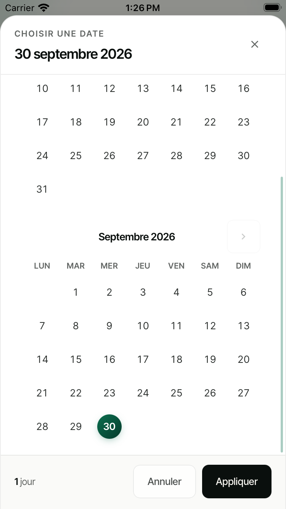
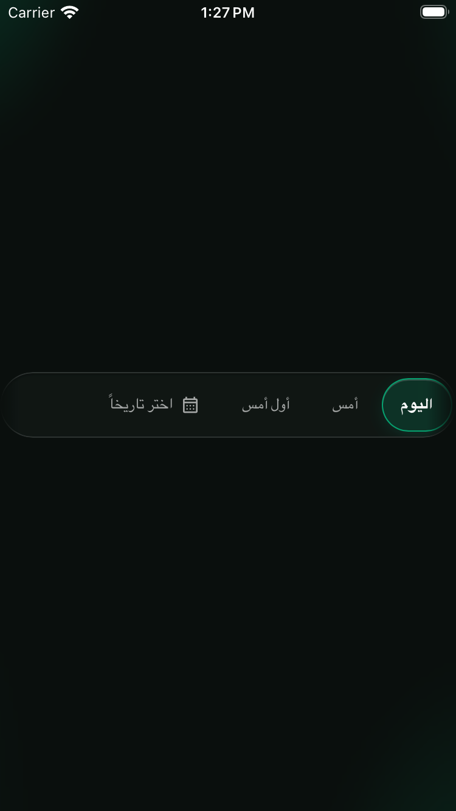
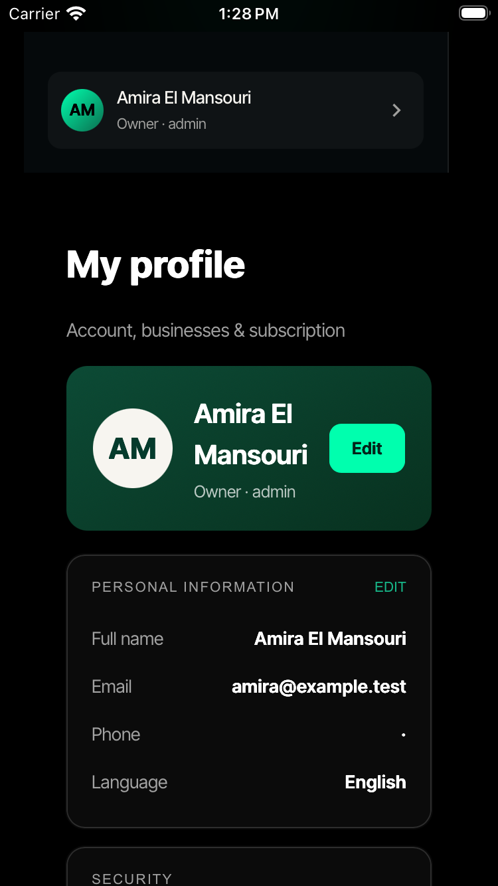
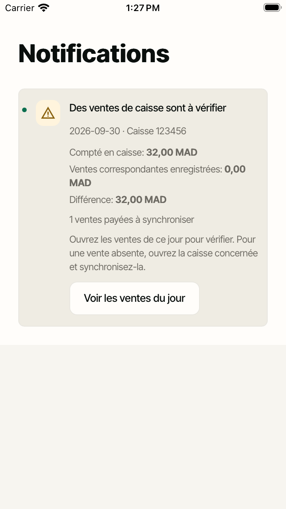

# Tickets #0143–#0146 · implementation and QA

## Scope and status

- Base: latest main `f7f9193e733315cf20f937dbaaecddcc8cb98d69`.
- Test-harness cleanup robustness: `0e820187` (temporary disposal retries only; product code unchanged).
- Runtime commits: `00f08a9798a59992a2c765545ac743468d4ee67c` and `77736fb83094297ca87010e7619b08cd5fb7b11c`.
- All four fixes implemented, regression tested and verified in isolated browser and native fixtures. Handoff destination is **Testing**, never Done; a human still verifies the updated app against their account.
- Public asset revisions were advanced with `tools/bump-stamp.js`; new suites are wired into `tools/check.js`.
- No production financial writes, account deletions, merchant/staff code entry, physical phone installation or App Store publication.

| Ticket | Root cause | Implemented outcome | Evidence |
| --- | --- | --- | --- |
| #0143 | A document overflow lock did not fix the iOS body position; the calendar did not have a constrained flex scrolling region. | Shared nested body-position lock with exact restoration and orphan-overlay recovery. Calendar owns momentum scrolling, pinned header/footer and safe-area spacing; real month/range/close taps work. | Date browser regression, native calendar swipes/taps, clean-commit MCP proof. |
| #0144 | Shared date track lacked consistent mobile overflow; native Home overrides and the chart swipe handler competed with it. `scrollIntoView` could move the document. | Shared horizontal momentum track, proximity snapping, edge hint, 44pt pills, liquid-lens selected state and RTL. Selection reveals only the track, never the page. Native chart gestures ignore the track. | Both phone widths, FR/EN/AR, light/dark, native horizontal and vertical drags; no swipe selects a day. |
| #0145 | Hardcoded first-paint demo card, incomplete real-session detection, asynchronous stale identity callbacks, cached profile fields and a desktop cloned card escaping single-element updates. | Neutral real/pending card, authoritative `/api/me` owner name/initials, useful real profile destination. Owner, operator and re-paired store are guarded; all clones follow identity. Local demo unchanged. | Identity browser suite including seeded previous-owner fields, desktop MCP card/profile menu, native owner card to profile in six locale/theme combinations. |
| #0146 | An old open report's empty manifest/zero total was compared with the whole subsequently growing server ledger; copy was French-only, jargon-heavy and repeated. | Open/partial reports compare the receipts they actually declare, including amount/payment mismatches. Full closed-day comparison retained. Meaningful warnings have translated, locale-formatted structured totals, hidden zero counters, merchant/day sales action, persistent deduplication and resolved state. | Production read-only diagnosis, endpoint truth regression, three-language copy/dedup/resolution tests, actual notification UI and native action taps. |

## #0146 · what the 32 MAD actually was

Read-only production queries confirmed:

- The September 30 open report was empty (0 cents, empty receipt manifest), last updated **2026-09-30 09:00:35.698 UTC**.
- Takeaway sale reference 2 was recorded for **3200 cents, cash**, at **2026-09-30 21:39:08.460 UTC**, and was not voided.
- Both belong to the same business day with the 05:00 cutoff. The sale arrived approximately 12 hours 38 minutes after the report snapshot.

This was a **stale open-report false positive**, not evidence of a lost sale or a timezone mismatch. The 32 MAD was already recorded by the server. Matching only the open report's declared receipts prevents that false alarm; genuinely missing or mismatched paid receipts remain actionable. All diagnostic remote queries reported **rows_written: 0**. No production reconciliation endpoint was called during diagnosis because its setup path can create schema objects. Private merchant identifiers and full database dumps are intentionally not checked in.

## Files

- Shared dates/overlays: `assets/interactive.js`, `assets/dateRange.js`, `assets/mobile.css`, calendar rules in `dashboard.html`.
- Native gesture/layout compatibility: `app/src/native-runtime.js`, `app/src/native-runtime.css`.
- Identity/profile: `assets/kiwi-env.js`, `assets/identity.js`, `assets/account.js`, profile menu in `assets/interactive.js`, card in `dashboard.html`, operator's authorized secondary-store owner lookup in `functions/api/me.js`.
- Reconciliation: `functions/api/z-reconciliation.js`, `assets/z-reconciliation.js`, translated keys in `assets/i18n.js`, sales-day action in `assets/pages.js` and `assets/pages-pro.js`.
- Stamp propagation: dashboard/caisse/serveur HTML, `kiwi-sw.js`, `tools/asset-stamps.json`.
- Test wiring/updated expectations: `tools/check.js`, `tools/native-pass5-test.mjs`, `tools/operating-day-operator-test.mjs`, `tools/restaurant-sync-release-test.mjs`, `tools/maison-dashboard-browser-test.mjs`, `tools/kiwi-ui-qa-mcp-test.mjs`.

## Shared date inventory and verification boundary

| Surface | Shared mechanism | Verification |
| --- | --- | --- |
| Home | Legacy `renderSelector`, shared track/reveal/calendar | Bundled owner-home browser route plus native shared component gestures. |
| Daily report | `mountDaySelector`, shared calendar | Actual dashboard MCP navigation and phone calendar; browser + native gesture/range tests. |
| Orders / Sales | `mountDaySelector`, shared calendar | Actual bundled Orders route and shared selector tests; correct sales-day route action checked. |
| Stock movements / receiving | `Kiwi.modal` and native date inputs | Code inventory; common modal/body-lock regressions, not a separate simulator journey. |
| Team / Planning | `Kiwi.modal` and native date inputs | Code inventory; common lock applies, not a separate simulator journey. |
| Reservations | Native datetime input inside `Kiwi.modal` | Code inventory; common lock applies, not a separate simulator journey. |

These are not per-screen locking patches. Browser-owned native date inputs are not the shared calendar sheet. The shared sheet has X, scrim, Cancel, Apply and Escape close paths; it does not support a dismiss-by-swipe-down gesture, so none is claimed. Native swipe tests exercise its scrolling content.

## Regression evidence

New guards, all wired into the gate:

- `tools/date-controls-browser-test.mjs`: **168 checks**, real CDP touch/wheel input at 375×667 and 402×874, FR/EN/AR, light/dark. Sheet content scrolls while the background remains fixed; every pill reachable, selection visible, swipe not tap, exact restoration and no horizontal page overflow.
- `tools/owner-identity-browser-test.mjs`: **104 assertions**, owner/operator/paired/failure/demo, stale previous-owner cache seeded, neutral pending profile, useful profile tap, cloned desktop card updated.
- `tools/z-alert-copy-test.mjs`: **39 checks**, translated totals, hidden zeros, actionable sales day, notification structure/RTL isolation, re-entry/reload dedup and resolution.
- `tools/z-alert-truth-test.mjs`: endpoint fixtures covering empty stale report versus later 32 MAD, genuine missing receipt, amount/payment mismatch, partial/closed-day totals, operator secondary store and authorization scope.
- `tools/z-reconciliation-browser-test.mjs`: **64 checks**, actual notification/day-route UI and missing/closed/live report cases.

Before-fix runs used the untouched detached base at `/private/tmp/kiwi-143-146-baseline`. The new date track assertion, calendar body-position lock assertion, neutral real-identity assertion and stale-open-report assertion each fail there. Baseline tracked files remained unchanged. Updated older assertions reflect intentional behavior changes, not suppressed failures: partial report scope, owner-versus-business identity, translated notification copy and warning action's sales-day destination.

### Final gate

**PASS:** `node tools/check.js` completed with exit 0: `all checks passed (1 warning(s))`. Final log: `/Users/zaka/.codex/artifacts/tickets-143-146/gate-release-stable.log`, on `0e82018743c1881b1e5df12f77abf10d4036b393` (same runtime code verified at `77736fb8`). This documentation/screenshot-only commit does not alter that tested runtime.

The first final run reached every suite but one native owner browser navigation exceeded its 30-second wait; the first targeted retry also timed out, while a second unmodified retry and the untouched base passed. The next complete run passed that browser suite but hit `ENOTEMPTY` while disposing a temporary Git fixture after stamp/hook assertions. Its targeted retry passed all 34 assertions, as did five untouched-base runs. `0e820187` adds bounded retries only to disposal of those disposable directories; no assertions or product code are retried/suppressed/changed. A final complete gate was then run again rather than describing either failed full run as green. The existing `background:var(--ink)` debt warning is reported separately; this change did not introduce more of that debt.

## Native simulator evidence

Only these devices were used:

- iPhone 17 Pro: `D53BB4E4-F195-41EF-8DE2-9F74BAEADC62`.
- iPhone SE: `13A85612-BDD7-4BF0-98F2-736D76D44C57`.

No Pro Max. Both ran actual WebKit components in the isolated `com.kiwios.pro.qa143` harness with Xcode-driven taps and drags, synthetic identity/financial fixtures and FR/EN/AR × light/dark. The existing compiled Swift shell was reused with the current product web bundle; this was **not** a newly signed physical-device release build. Product bundle fingerprint: `855a682e99bb4ae01361d853d1b513a2cd9b76f9014010dd5daea702675e0a75` at runtime commit `77736fb8`.

All final suites succeeded, with **48 exported screenshots**:

- `clean-date-pro.xcresult`: Pro calendar/day gestures, six combinations, passed.
- `clean-owner-pro-final.xcresult`: Pro owner/profile and warning/day action, six combinations, passed.
- `clean-se-final.xcresult`: both suites on SE, six combinations, passed.

An earlier artifact bridge request timed out while changing appearance; increasing only the private driver's request wait and retrying produced the final results above. Superseded captures and the interrupted combined Pro result are not proof. Selected unchanged captures and their native attachment metadata/SHA-256 hashes are stored in [screenshots](screenshots/2026-10-01-tickets-0143-0146/manifest.json).

The original simulator application was restored/updated to the unchanged product bundle without uninstalling it or clearing its data. The disposable synthetic QA application and its owned local bridge were removed/stopped after testing.

## Clean-commit kiwi-ui-qa proofs

All four `finish_ui_proof` results report `gitDirty:false` and runtime HEAD `77736fb83094297ca87010e7619b08cd5fb7b11c`. Captured using the repository's actual local stdio MCP server, not fabricated JSON:

| Ticket | Local proof directory | Actual scope |
| --- | --- | --- |
| #0143 | `kiwi-ui-proof-Ai5wt4` | Actual synthetic hotel dashboard Daily report custom calendar, calendar scroll and pinned Apply footer. |
| #0144 | `kiwi-ui-proof-djAE96` | Actual custom-date reachability, Cancel and Today selection. Horizontal swipe mechanics verified separately in browser/native suites. |
| #0145 | `kiwi-ui-proof-N7nWHw` | Desktop cloned real synthetic owner card and actual profile menu destination. Native suite verifies the complete card-to-profile tap separately. |
| #0146 | `kiwi-ui-proof-qv4AR5` | Actual restaurant notification UI with a genuine synthetic 5 MAD discrepancy and sales-day button. False-positive and action correctness verified separately. |

Proof files and screenshots are under `/var/folders/0g/q6yc1cn92hzc7w4yt40kjzrw0000gn/T/<directory>/proof.json`; full logs/Xcode results/private read-only query evidence are retained locally at `/Users/zaka/.codex/artifacts/tickets-143-146`. After validated mirror push, these proofs are supplied unchanged to `submit_for_testing`. No ticket is marked Done by the agent.

## Remaining verification / adjacent polish

- **Physical iPhone and live authenticated Amira flow remain unverified.** Existing pairing/auth gates prevent that repetition without owner participation; no code/PIN was entered or authentication weakened. Synthetic simulator/browser fixtures are not live-account proof.
- Web deployment does not update an already installed bundled iPhone app. A fresh locally installed or distributed build is still necessary for phone retesting; no such distribution/publication is claimed here.
- Adjacent minor copy polish explicitly deferred: singular paid-sale counter grammar (e.g. “1 paid sales”), and existing Arabic profile section-eyebrow letter spacing. Core warning translations/amount isolation are fixed, but these are not represented as 10/10 polish.
- The isolated notification fixture's English page heading and trimmed native card chrome are fixture limitations, not proof of full live dashboard chrome parity. Native pages themselves were not replaced with mock screenshots.
- Native build/release readiness and App Review submission are outside these four tickets. No release publication was performed.
